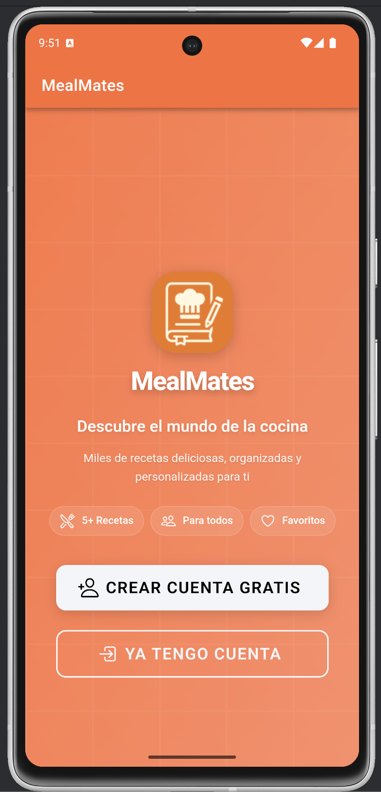
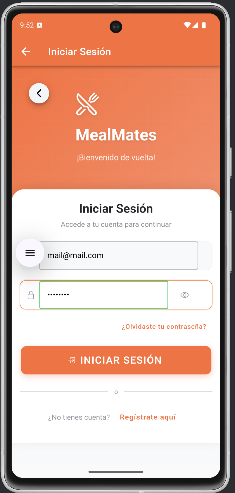
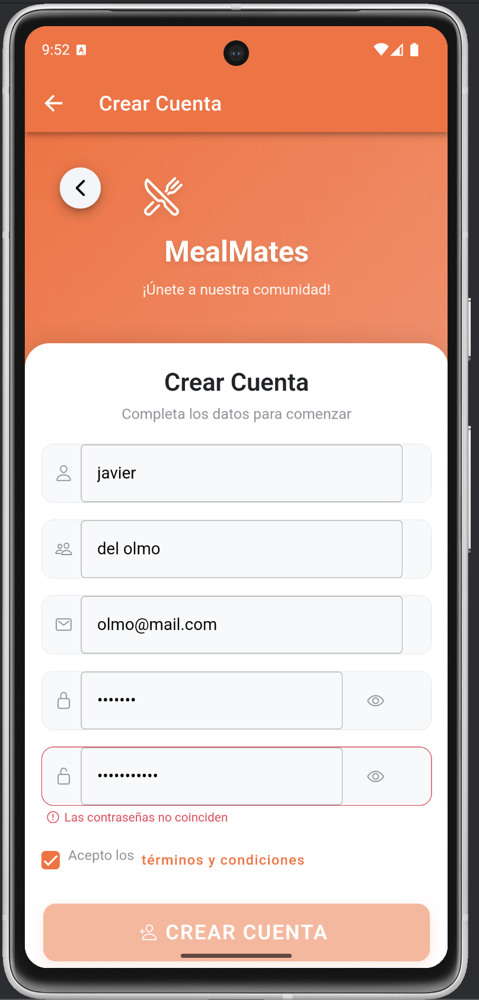
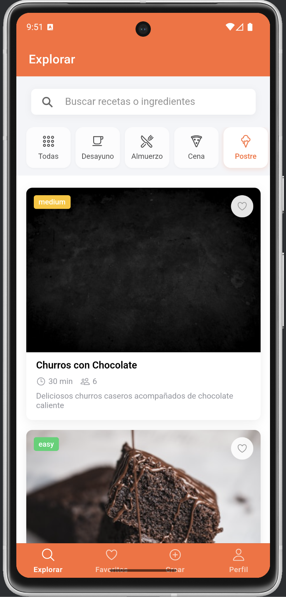
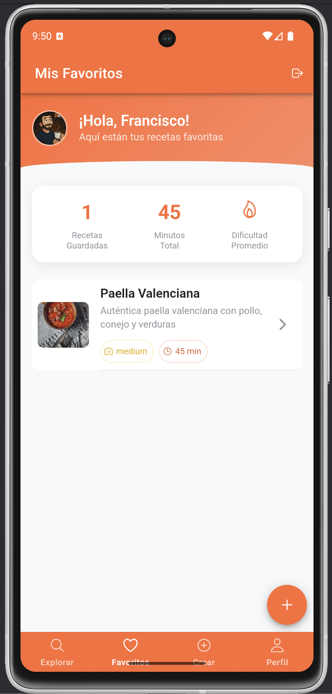
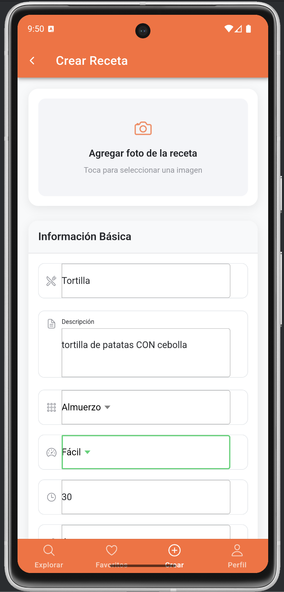
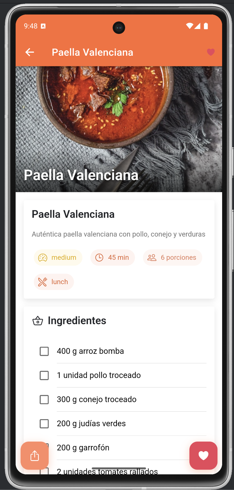
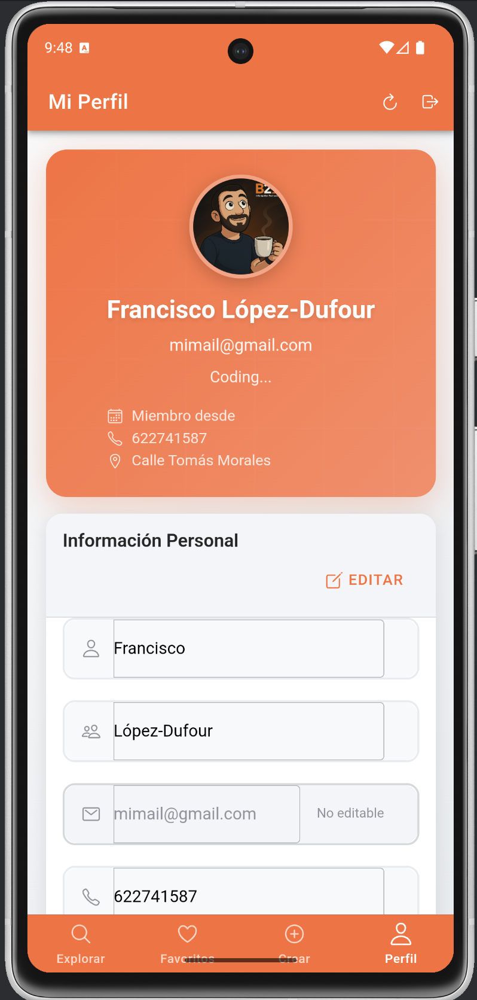
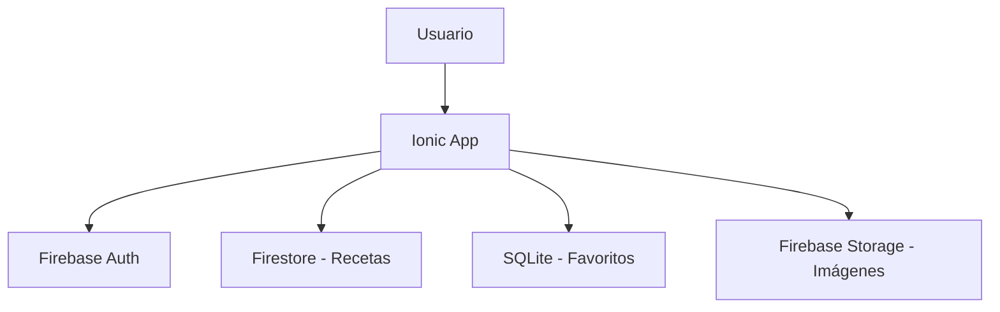

# 🍳 MealMates - Sprint 4: Ionic + SQLite

[](https://angular.io/)
[](https://www.typescriptlang.org/)
[](https://firebase.google.com/)
[](https://ionicframework.com/)
[](https://capacitorjs.com/)
[](https://www.sqlite.org/)

> **Una app híbrida pensada para planificar tus comidas semanales y gestionar recetas personalizadas de forma eficiente y visual, con Firebase en la nube y SQLite local** 🚀

**📚 Asignatura:** Programación Web y Móvil  

**📅 Fecha de entrega:** 25 Mayo 2025

**👨‍💻 Autores:**
- Elena Artiles Morales  
- Pablo Monzón Toca  
- Francisco Javier López-Dufour Morales

## 🎯 Sprint 4: Las 4 Pantallas Fundamentales

Este proyecto implementa **las 4 pantallas requeridas** para el Sprint 4, creando una experiencia completa de descubrimiento y gestión de recetas:

| Pantalla | Descripción | Pantalla | Descripción |
|----------|-------------|----------|-------------|
|  | Página principal con las últimas recetas |  | Inicio de sesión con email/password |
|  | Registro de nuevos usuarios |  | Explorar recetas por categorías |
|  | Recetas guardadas como favoritas |  | Crear y publicar nuevas recetas |
|  | Vista detallada de una receta |  | Perfil de usuario y preferencias |

### 📱 **1. Registro de Usuarios**

```typescript
// 🔥 Firebase Auth + Firestore Profile Storage
✅ Formulario completo con email/password
✅ Datos adicionales: nombre, apellidos, foto de perfil
✅ Validación en tiempo real
✅ Almacenamiento seguro en Firestore
```

### 🔐 **2. Autenticación de Usuarios**

```typescript
// 🚪 Login con Firebase Authentication
✅ Email/password authentication
✅ Gestión de estados de autenticación
✅ Redirección automática post-login
✅ Manejo de errores elegante
```

### ❤️ **3. Pantalla de Favoritos**

```typescript
// 📱 SQLite + Firebase Hybrid Architecture
✅ Lista de recetas desde Firebase Firestore
✅ Marcado visual de favoritos (desde SQLite)
✅ Solo accesible para usuarios autenticados
✅ Navegación a detalle con un clic
✅ Sincronización automática local/remota
```

### 🍽️ **4. Pantalla de Detalle**

```typescript
// 🎨 Vista completa con toggle de favoritos
✅ Información completa de la receta
✅ Imagen característica de alta calidad
✅ Botón para agregar/quitar de favoritos
✅ Almacenamiento instantáneo en SQLite
✅ Feedback visual inmediato
```

---

## ⚡ Stack Tecnológico de Vanguardia

### **Frontend Híbrido**

- **Ionic 8** + **Angular 19** con **Standalone Components**
- **TypeScript** con **Signals** para reactividad óptima
- **SCSS** con variables CSS customizadas
- **Capacitor** para acceso nativo a dispositivos

### **Backend & Bases de Datos**

- **🔥 Firebase Auth** - Autenticación de usuarios
- **🔥 Cloud Firestore** - Base de datos NoSQL en tiempo real
- **📱 SQLite** - Almacenamiento local de favoritos
- **🔥 Firebase Storage** - Imágenes de recetas y perfiles

### **Arquitectura Híbrida Inteligente**



---

## 🚀 Setup Rápido

### **Instalación Express**

```bash
# 📦 Clonar e instalar
git clone [url-del-repositorio]
cd MealMates-Ionic
npm install

# 🔧 Configurar Capacitor
npx cap sync

# 🌐 Ejecutar en desarrollo
ionic serve
```

### **Configuración Firebase**

```typescript
// src/firebase.config.ts
export const firebaseConfig = {
  projectId: 'pwm-angular', // ✅ Proyecto configurado
  // ... resto de credenciales
};
```

### **SQLite para Móviles**

```bash
# 📱 Agregar soporte SQLite
npm install @capacitor-community/sqlite
npx cap sync android  # o ios
```

---

## 📂 Arquitectura del Proyecto

```
📁 src/app/
├── 🔐 pages/
│   ├── 📝 register/           # Sprint 4.1 - Registro
│   ├── 🚪 login/              # Sprint 4.2 - Autenticación
│   ├── ❤️ favorites/          # Sprint 4.3 - Lista Favoritos
│   └── 🍽️ recipe-detail/      # Sprint 4.4 - Detalle + Toggle
├── 🛠️ services/
│   ├── auth.service.ts        # Firebase Authentication
│   ├── recipe.service.ts      # Firestore Operations
│   └── sqlite.service.ts      # Local Favorites Storage
└── 📊 models/
    ├── user.model.ts          # Interfaz Usuario
    ├── recipe.model.ts        # Interfaz Receta
    └── favorite.model.ts      # Interfaz Favorito Local
```

---

## 🎨 Funcionalidades Implementadas

### **🔥 Autenticación Completa**

- [x] Registro con datos adicionales
- [x] Login con email/password
- [x] Gestión de sesiones
- [x] Guards de protección de rutas
- [x] Persistencia de estado

### **📱 Gestión de Favoritos Híbrida**

- [x] Lista de recetas desde Firestore
- [x] Favoritos almacenados en SQLite
- [x] Sincronización automática
- [x] Indicadores visuales de favoritos
- [x] Acceso solo para usuarios autenticados

### **🍽️ Experiencia de Recetas**

- [x] Visualización detallada con imágenes
- [x] Toggle de favoritos en tiempo real
- [x] Información completa (ingredientes, instrucciones)
- [x] Metadatos (tiempo, dificultad, porciones)
- [x] Navegación fluida entre pantallas

### **💾 Persistencia Inteligente**

- [x] Firebase para datos compartidos
- [x] SQLite para preferencias locales
- [x] Sincronización offline
- [x] Fallbacks automáticos

---

## 🔧 Scripts de Desarrollo

```bash
# 🌐 Desarrollo Web
npm run start              # ionic serve

# 📱 Build para Móviles
npm run build              # ionic build
npx cap sync android       # Sincronizar Android
npx cap open android       # Abrir Android Studio

# 🧪 Testing & Calidad
npm run test               # Unit tests
npm run lint               # Code linting
```

---

## 📊 Modelos de Datos

### **👤 Usuario (Firestore)**

```typescript
interface User {
  id: string; // UID de Firebase Auth
  email: string; // Email de registro
  firstName: string; // ✅ Dato adicional requerido
  lastName: string; // ✅ Dato adicional requerido
  profileImageUrl?: string; // ✅ Imagen de perfil
  createdAt: Timestamp;
  updatedAt: Timestamp;
}
```

### **🍽️ Receta (Firestore)**

```typescript
interface Recipe {
  id: string; // ID único
  title: string; // Nombre de la receta
  description: string; // Descripción
  ingredients: Ingredient[]; // Lista de ingredientes
  instructions: string[]; // Pasos detallados
  imageUrl: string; // ✅ Imagen característica
  cookingTime: number; // Tiempo en minutos
  difficulty: 'easy' | 'medium' | 'hard';
  authorId: string; // Creador
  isPublic: boolean; // Visibilidad
}
```

### **❤️ Favorito (SQLite Local)**

```typescript
interface Favorite {
  id: number; // ID local
  recipeId: string; // Referencia a receta
  userId: string; // Usuario propietario
  addedAt: Date; // Fecha de marcado
}
```

---

## 🔐 Seguridad Firebase

### **Reglas Firestore**

```javascript
rules_version = '2';
service cloud.firestore {
  match /databases/{database}/documents {
    // 👤 Usuarios: solo su propio perfil
    match /users/{userId} {
      allow read, write: if request.auth.uid == userId;
    }

    // 🍽️ Recetas: lectura pública, escritura propia
    match /recipes/{recipeId} {
      allow read: if request.auth != null && resource.data.isPublic;
      allow write: if request.auth.uid == resource.data.authorId;
    }
  }
}
```

---

## 🎯 Cumplimiento Sprint 4

| Requisito                 | ✅ Status   | Implementación                       |
| ------------------------- | ----------- | ------------------------------------ |
| **Registro Firebase**     | ✅ Completo | `register.page.ts` + Firestore       |
| **Autenticación**         | ✅ Completo | `login.page.ts` + Firebase Auth      |
| **Lista Favoritos**       | ✅ Completo | `favorites.page.ts` + SQLite híbrido |
| **Detalle + Toggle**      | ✅ Completo | `recipe-detail.page.ts` + SQLite     |
| **Solo usuarios auth**    | ✅ Completo | `AuthGuard` + Route protection       |
| **Información adicional** | ✅ Completo | Perfil completo en Firestore         |
| **Imagen característica** | ✅ Completo | Firebase Storage + URLs              |
| **SQLite favoritos**      | ✅ Completo | Capacitor SQLite + fallbacks         |

---

## 🚀 Demo & Testing

### **Credenciales de Prueba**

```bash
Email: test@mealmates.com
Password: test123456
```

### **Flujo de Prueba Completo**

1. 📱 **Registro**: Crear cuenta con datos adicionales
2. 🚪 **Login**: Autenticarse con credenciales
3. ❤️ **Favoritos**: Ver lista de recetas, favoritos marcados
4. 🍽️ **Detalle**: Seleccionar receta, toggle favoritos
5. 💾 **Persistencia**: Verificar SQLite + Firebase sync

---

## 🏆 Características Destacadas

### **🎨 UX/UI Premium**

- Material Design con tema personalizado
- Animaciones fluidas nativas
- Feedback visual inmediato
- Responsive design adaptativo

### **⚡ Performance Optimizada**

- Lazy loading de componentes
- SQLite con fallbacks automáticos
- Compresión de imágenes
- Caché inteligente

### **🔧 Arquitectura Escalable**

- Standalone components modulares
- Signals para reactividad
- Servicios desacoplados
- Testing integrado

---

## 📱 Deploy & Distribución

### **Android APK**

```bash
# 📦 1. Build latest web assets
npm run build

# 📱 2. Copy to Android project
npx cap copy android

# 🔄 3. Sync Capacitor plugins
npx cap sync android

# 🏗️ 4. Open in Android Studio
npx cap open android
# Then: Build → Clean Project → Rebuild Project → Run
```

### **Web/PWA Updates**

```bash
# 🌐 Auto-reload in development
ionic serve  # Changes apply immediately

# 🚀 Production deployment
npm run build
firebase deploy --only hosting
```

---

## 🎯 Roadmap Futuro

### **Sprint 5+**

- [ ] 👥 Sistema social (seguir usuarios)
- [ ] 📝 Creación de recetas por usuarios
- [ ] 🔍 Búsqueda avanzada con filtros
- [ ] 📊 Analytics de uso
- [ ] 🌙 Modo oscuro
- [ ] 🌍 Internacionalización

---

## 🤝 Contribución

### **Estándares del Proyecto**

- 🎯 **Foco**: Sprint 4 core functionality
- 📱 **Mobile-first**: Diseño pensado para móvil
- 🔥 **Firebase-centric**: Aprovecha todo el ecosistema
- 📊 **Data-driven**: SQLite + Firestore híbrido

---

## 📞 Información del Proyecto

- **🎓 Curso**: Programación Web y Movil
- **🚀 Sprint**: 4 - Firebase + SQLite Integration
- **🔥 Firebase Project**: `pwm-angular`
- **📱 Tecnologías**: Ionic 8 + Angular 19 + Firebase + SQLite

---

**🎉 ¡Sprint 4 completado con éxito! Una app híbrida que demuestra la perfecta integración entre Firebase y SQLite en el ecosistema Ionic/Angular.**

_Desarrollado con ❤️ y mucho ☕ usando las mejores prácticas de desarrollo móvil híbrido_

---

**Result**: ✅ No custom Firestore indexes required, app works immediately

---

### **📱 PWA Configuration**

```json
// 🎯 Enhanced PWA Manifest
{
  "name": "MealMates - Recetas Saludables",
  "short_name": "MealMates",
  "description": "Descubre, crea y comparte recetas saludables y deliciosas",
  "start_url": "/",
  "display": "standalone",
  "theme_color": "#3880ff",
  "background_color": "#ffffff",
  "icons": [
    // Complete icon set for all device sizes
    // Proper maskable icons for Android
  ]
}
```

**Angular Configuration Updated**:

```typescript
// angular.json assets configuration
{
  "glob": "manifest.json",
  "input": "src/assets",
  "output": "./"  // Copies to web root
}
```

---
